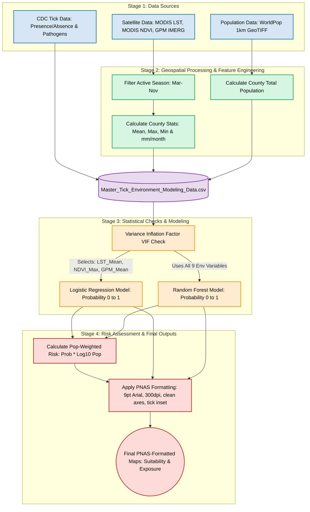

# flow_chart

```mermaid
flowchart TD
    %% Define Styles for Stages
    classDef dataStage fill:#d4e6f1,stroke:#2980b9,stroke-width:2px,color:#000
    classDef procStage fill:#d5f5e3,stroke:#27ae60,stroke-width:2px,color:#000
    classDef csvFile fill:#e8daef,stroke:#8e44ad,stroke-width:2px,color:#000
    classDef modelStage fill:#fdebd0,stroke:#f39c12,stroke-width:2px,color:#000
    classDef outStage fill:#fadbd8,stroke:#c0392b,stroke-width:2px,color:#000
 
    %% Define Data Sources (Blue)
    subgraph Stage 1: Data Sources
        CDC[CDC Tick Data: Presence/Absence & Pathogens]:::dataStage
        SatData[Satellite Data: MODIS LST, MODIS NDVI, GPM IMERG]:::dataStage 
        PopData[Population Data: WorldPop 1km GeoTIFF]:::dataStage
    end
 
    %% Define Processing Phase (Green)
    subgraph Stage 2: Geospatial Processing & Feature Engineering
        TimeFilter[Filter Active Season: Mar-Nov]:::procStage
        CountyStats[Calculate County Stats: Mean, Max, Min & mm/month]:::procStage
        PopStats[Calculate County Total Population]:::procStage
    end
 
    SatData --> TimeFilter --> CountyStats
    PopData --> PopStats
 
    %% Define Master Dataset (Purple)
    MasterCSV[(Master_Tick_Environment_Modeling_Data.csv)]:::csvFile
    CDC --> MasterCSV
    CountyStats --> MasterCSV
    PopStats --> MasterCSV
 
    %% Define Modeling Phase (Orange)
    subgraph Stage 3: Statistical Checks & Modeling
        VIF[Variance Inflation Factor VIF Check]:::modelStage
        LR[Logistic Regression Model: Probability 0 to 1]:::modelStage
        RF[Random Forest Model: Probability 0 to 1]:::modelStage
    end
    MasterCSV --> VIF
    VIF -- "Selects: LST_Mean, NDVI_Max, GPM_Mean" --> LR
    VIF -- "Uses All 9 Env Variables" --> RF
 
    %% Define Output Phase (Red/Pink)
    subgraph Stage 4: Risk Assessment & Final Outputs
        RiskCalc[Calculate Pop-Weighted Risk: Prob * Log10 Pop]:::outStage
        MapFormat[Apply PNAS Formatting: 9pt Arial, 300dpi, clean axes, tick inset]:::outStage
        OutMaps((Final PNAS-Formatted Maps: Suitability & Exposure)):::outStage
    end

    LR --> RiskCalc
    RF --> RiskCalc
    RiskCalc --> MapFormat
    LR --> MapFormat
    RF --> MapFormat
    MapFormat --> OutMaps
```
